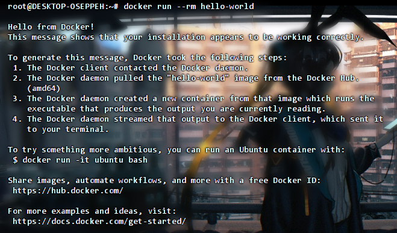

# Docker 的卸载与安装

> 本节将指导你完成 Docker 的卸载与安装 的全流程操作。
>
> 适用系统：Debian / Ubuntu、RHEL / CentOS / Rocky / Alma

## 🎯 教程目标

本节你将学到：

- Docker的 **卸载** 与 **残留清理**
- 能够安装最新稳定版 Docker
- 配置镜像源、开机自启等常用优化

## 📦 步骤说明

### 1. 环境准备

| 项目     | 说明                                                         |
| -------- | ------------------------------------------------------------ |
| 操作系统 | Ubuntu 20.04+ / Debian 11+、CentOS 7.9+ / Rocky 8+ 等 x86_64 或 aarch64 |
| 权限     | `sudo` 或 `root`                                             |
| 网络     | 可访问 `download.docker.com`建议同时配置镜像加速             |
| 依赖包   | `curl gnupg2 ca-certificates lsb-release`（Deb 系） `yum-utils device-mapper-persistent-data lvm2`（RHEL 系） |
| 内核要求 | ≥ 3.10（CentOS 7）；推荐 5.x 以上，启用 `cgroupv2`           |

> 📝 **备份提醒**
> 若服务器已运行容器，请提前备份重要数据卷与镜像 (`docker save`)，以防卸载时误删。

### 2. 操作步骤

#### 2.1 卸载 Docker

Debian / Ubuntu

```sh
# === 1. 停止服务 ===

# 停止 Docker 服务，避免卸载时资源仍被占用
sudo systemctl stop docker.service

# === 2. 卸载 ===

# 卸载 Docker （如果已安装）
sudo apt-get remove -y docker-ce docker-ce-cli containerd.io docker-buildx-plugin docker-ce-rootless-extras docker-compose-plugin

# === 3. 删除数据与配置 ===

# ⚠️ 高危操作：永久删除所有容器、镜像、卷、网络等运行数据！
# 若需保留，请提前 docker save / docker cp 导出
sudo rm -rf /var/lib/docker /var/lib/containerd

# 删除 Docker 系统配置目录（如 daemon.json、key.json 等）
sudo rm -rf /etc/docker

# 删除 Docker 的 systemd 自定义服务配置目录
sudo rm -rf /etc/systemd/system/docker.service.d

# === 4. 清理 systemd 与用户残留 ===

# 重新加载 systemd 服务列表，确保已删除服务被注销
sudo systemctl daemon-reload

# 自动清除无用的依赖包（例如 containerd.io 等依赖）
sudo apt-get autoremove -y

# 删除 docker 用户组（若存在）
sudo groupdel docker

# ⚠️ 删除当前用户下的 Docker 配置（包含登录凭据、缓存等）
# 包括 ~/.docker/config.json 登录配置，慎重
rm -rf ~/.docker

```

------

参考截图

`sudo systemctl stop docker`


`sudo apt-get remove -y docker-ce docker-ce-cli containerd.io docker-buildx-plugin docker-compose-plugin`


------

CentOS / Rocky / Alma

```sh
# === 1. 停止服务 ===

# 停止 Docker 服务，避免卸载时资源仍被占用
sudo systemctl stop docker

# === 2. 卸载 ===

# 卸载 Docker 主程序及常用插件
sudo yum remove -y docker-ce docker-ce-cli containerd.io docker-buildx-plugin docker-compose-plugin docker-ce-rootless-extras

# 如果系统使用 dnf（如 Rocky 8+ / AlmaLinux 8+），可用：
# sudo dnf remove -y docker-ce docker-ce-cli containerd.io docker-buildx-plugin docker-compose-plugin docker-ce-rootless-extras

# === 3. 删除数据与配置 ===

# ⚠️ 高危操作：永久删除所有容器、镜像、卷、网络等运行数据！
# 若需保留，请提前 docker save / docker cp 导出
sudo rm -rf /var/lib/docker /var/lib/containerd

# 删除 Docker 系统配置目录（如 daemon.json、key.json 等）
sudo rm -rf /etc/docker

# 删除 Docker 的 systemd 自定义服务配置目录
sudo rm -rf /etc/systemd/system/docker.service.d

# === 4. 清理 systemd 与用户残留 ===

# 重新加载 systemd 服务列表，确保已删除服务被注销
sudo systemctl daemon-reload

# 自动清除未使用的依赖包
sudo yum autoremove -y
# 或 dnf 系统用：sudo dnf autoremove -y

# 删除 docker 用户组（若存在）
sudo groupdel docker

# ⚠️ 删除当前用户下的 Docker 配置（包含登录凭据、缓存等）
rm -rf ~/.docker
```

------

⚠️ **请注意！**
 `/var/lib/docker` 和 `/var/lib/containerd` 中包含镜像、容器、网络等数据。若需保留，请先备份或跳过 `rm` 步骤。

------

#### 2.2 安装

##### 2.2.1 Debian / Ubuntu

1. 使用官方源安装（适合网络正常）

   ```sh
   # 1) 安装必要的系统工具
   # 包括 ca 证书管理、网络工具、GPG 支持和发行版信息获取工具
   sudo apt-get update
   sudo apt install \
       apt-transport-https \
       ca-certificates \
       curl \
       gnupg \
       lsb-release
   
   # 2) 添加 Docker 官方 GPG 公钥
   # 使用 dearmor 格式并保存到受信任的 keyring 路径中
   sudo mkdir -p /etc/apt/keyrings
   curl -fsSL https://download.docker.com/linux/ubuntu/gpg | \
     sudo gpg --dearmor -o /etc/apt/keyrings/docker.gpg
   
   # 3) 添加 Docker 官方稳定版仓库
   # 注意：此处使用的是 $(lsb_release -cs)，若系统为 noble 等尚未支持的版本，请替换为 jammy/focal 等稳定版本
   echo "deb [arch=amd64 signed-by=/etc/apt/keyrings/docker.gpg] \
   https://download.docker.com/linux/ubuntu $(lsb_release -cs) stable" | \
   sudo tee /etc/apt/sources.list.d/docker.list > /dev/null
   
   # 4) 更新 apt 索引并安装 Docker 引擎及依赖组件
   sudo apt-get update
   sudo apt-get install -y docker-ce docker-ce-cli containerd.io
   
   # 5) 启动 Docker 服务并设置为开机自启
   sudo systemctl enable --now docker
   
   # 6) 可选操作：将当前用户加入 docker 用户组
   # 这样后续可以无需 sudo 运行 docker 命令（执行完需重新登录）
   sudo usermod -aG docker $USER
   ```

   ------

2. 使用阿里云镜像源安装（国内）

   ```sh
   # 1) 安装必要的系统工具
   # 包括 ca 证书管理、网络工具、GPG 支持和发行版信息获取工具
   sudo apt-get update
   sudo apt install \
       apt-transport-https \
       ca-certificates \
       curl \
       gnupg \
       lsb-release
   
   # 2) 添加 Docker GPG 公钥（来自阿里云镜像站）
   # 使用 dearmor 格式并保存到受信任的 keyring 路径中
   curl -fsSL https://mirrors.aliyun.com/docker-ce/linux/ubuntu/gpg | \
     sudo gpg --dearmor -o /usr/share/keyrings/docker-archive-keyring.gpg
   
   # 3) 添加阿里云 Docker 稳定版仓库
   # 注意：此处使用的是 $(lsb_release -cs)，部分新版本如 noble 可能不被支持
   # 可根据实际情况替换为 jammy（22.04）或 focal（20.04）等稳定版本
   echo "deb [arch=amd64 signed-by=/usr/share/keyrings/docker-archive-keyring.gpg] \
   https://mirrors.aliyun.com/docker-ce/linux/ubuntu $(lsb_release -cs) stable" | \
   sudo tee /etc/apt/sources.list.d/docker.list > /dev/null
   
   # 4) 更新 apt 索引并安装 Docker 引擎及依赖组件
   sudo apt-get update
   sudo apt-get install -y docker-ce docker-ce-cli containerd.io
   
   # 5) 启动 Docker 服务并设置为开机自启
   sudo systemctl enable --now docker
   
   # 6) 可选操作：将当前用户加入 docker 用户组
   # 这样后续可以无需 sudo 运行 docker 命令（执行完需重新登录）
   sudo usermod -aG docker $USER
   ```

##### 2.2.2 CentOS / Rocky / Alma

1. 使用官方源安装（适合网络正常）

   ```sh
   # 1) 安装工具（yum-utils）
   sudo yum install -y yum-utils
   
   # 2) 添加 Docker 官方仓库
   sudo yum-config-manager \
       --add-repo \
       https://download.docker.com/linux/centos/docker-ce.repo
   
   # 3) 安装 Docker 及插件（适用于 CentOS 7）
   sudo yum install -y docker-ce docker-ce-cli containerd.io docker-buildx-plugin docker-compose-plugin
   
   # 若为 CentOS 8+ / Rocky / AlmaLinux，建议使用 dnf：
   # sudo dnf install -y docker-ce docker-ce-cli containerd.io docker-buildx-plugin docker-compose-plugin
   
   # 4) 启动 Docker 并设置为开机自启
   sudo systemctl enable --now docker
   
   # 5) 可选：将当前用户加入 docker 用户组（执行后需重新登录）
   sudo usermod -aG docker $USER
   ```

2. 使用阿里云镜像源安装（网络不正常）

   ```sh
   # 1) 安装工具（yum-utils）
   sudo yum install -y yum-utils
   
   # 2) 添加阿里云 Docker 镜像源
   sudo yum-config-manager \
       --add-repo \
       http://mirrors.aliyun.com/docker-ce/linux/centos/docker-ce.repo
   
   # 3) 安装 Docker 及插件（适用于 CentOS 7）
   sudo yum install -y docker-ce docker-ce-cli containerd.io docker-buildx-plugin docker-compose-plugin
   
   # 若为 CentOS 8+ / Rocky / AlmaLinux，建议使用 dnf：
   # sudo dnf install -y docker-ce docker-ce-cli containerd.io docker-buildx-plugin docker-compose-plugin
   
   # 4) 启动 Docker 并设置为开机自启
   sudo systemctl enable --now docker
   
   # 5) 可选：将当前用户加入 docker 用户组（执行后需重新登录）
   sudo usermod -aG docker $USER
   ```

##### 2.2.3 验证安装

```sh
docker version
docker compose version
docker run --rm hello-world
```

示例截图

`docker version`


`docker compose version`


`docker run --rm hello-world`



#### 2.3 常用优化

##### 2.3.1 镜像加速

访问`/etc/docker/daemon.json`

```bash
vim /etc/docker/daemon.json
# 或者
nano /etc/docker/daemon.json
```


设置镜像(以下镜像源为参考，实际使用请使用可信镜像源)

```json
{
    "registry-mirrors": [
        "https://docker.mirrors.sjtug.sjtu.edu.cn",
        "https://cr.laoyou.ip-ddns.com",
        "https://docker.1panel.live",
        "https://image.cloudlayer.icu",
        "https://hub.fast360.xyz",
        "https://docker-0.unsee.tech",
        "https://docker.1panelproxy.com",
        "https://docker.tbedu.top",
        "https://dockerpull.cn",
        "https://docker.m.daocloud.io",
        "https://hub.rat.dev",
        "https://docker.kejilion.pro",
        "https://docker.hlmirror.com",
        "https://docker.imgdb.de",
        "https://docker.melikeme.cn",
        "https://ccr.ccs.tencentyun.com"
      ]
}
```

##### 2.3.2 非Root运行

`sudo usermod -aG docker $USER` → 重新登录

##### 2.3.3 修改数据目录

停止 Docker → `mv /var/lib/docker /data/docker` → `daemon.json` 添加 `{"data-root":"/data/docker"}`

## 🎥 视频地址

[Docker 的卸载与安装](https://www.bilibili.com/video/BV1SRT5z4Em4/?vd_source=78b0cb503540adde7afb8d3f4bb265ae)

## ❓ 常见问题

Q: docker: Error response from daemon: connection refused

A：Docker daemon 未运行：`systemctl status docker` 查看，若端口被占用或 JSON 配置格式错误需修正后重启。

------

> 本节内容遵循 Apache 2.0 协议，欢迎引用与转载，需保留原始署名。
