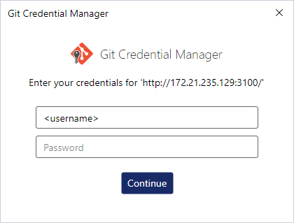

# 创建用户与代码仓库

> 本节将指导你完成 **创建用户与代码仓库** 的相关操作与实战演练。

## 🎯 教程目标

- 本节你将学到：
  - 如何在 Gitea 中创建新用户；
  - 如何为用户分配权限；
  - 如何创建新的代码仓库；
  - 如何通过 Git 操作远程仓库。

## 📦 步骤说明

### 1. 环境准备

确保你已经成功运行并访问 Gitea 服务，参考上一章节：[Gitea 的安装与基础配置](../../gitea/install/README.md)

- 确保你可以通过 [http://<你的服务器IP>:3100](http://172.21.235.129:3100) 正常访问 Gitea；
- 本节以管理员账户登录进行演示。

### 2. 操作步骤

#### 2.1 创建新用户

1. 以管理员身份登录 Gitea；
2. 右上角点击头像 → 管理后台；
3. 点击左侧菜单栏的 “用户管理”；
4. 点击右上角的 “新建账户”；
5. 填写新用户信息：
   - 用户名：`devuser`
   - 邮箱：`dev@example.com`
   - 密码：自定义
6. 点击 “创建账户” 完成。

> ✅ 你现在已经创建了一个普通用户 `devuser`。

#### 2.2 切换用户登录

1. 退出管理员账号；
2. 使用 `devuser` 登录；
3. 登录成功后，进入用户首页。

#### 2.3 创建代码仓库

1. 点击右上角 ➕ → “新建仓库”；
2. 仓库名称示例：`demo-repo`；
3. 可选设置：
   - 描述：一个用于演示的仓库
   - 私有仓库：可根据需要开启
   - 初始化仓库：勾选 “README 文件”
4. 点击 “创建仓库”。

> ✅ 你现在已经创建了第一个仓库。

#### 2.4 本地 Git 操作示例

确保你已安装 Git 工具：

```bash
git clone http://172.21.235.129:3100/devuser/demo-repo.git
cd demo-repo
echo "# Hello Gitea" > hello.md
git add .
git commit -m "init: add hello.md"
git push origin main
```

你现在可以回到 Gitea 页面，刷新仓库页面看到你刚刚提交的内容。

## 🎥 视频地址

[Gitea中创建用户与代码仓库](https://www.bilibili.com/video/BV1eCTWzdExs)

## ❓ 常见问题

### Q: 创建用户时提示邮箱已存在？

请确认该邮箱未被注册；若已注册，可尝试使用其他邮箱地址。

### Q: 无法推送代码？

请检查是否启用了 Gitea 的 SSH 或 HTTP 推送方式；
也可以进入仓库页面，点击 "Clone" 查看正确的远程地址。

如果是这个报错

```bash
> git push -u origin main
remote: Verify
fatal: Authentication failed for 'http://172.21.235.129:3100/devuser/demo-repo.git/'
```

可以尝试如下步骤:注意<username>需要填写你的用户名

```bash
# 1. 设置保存凭据
git config --global credential.helper store
# 2. 设置远程地址（包含用户名）
git remote set-url origin http://<username>@172.21.235.129:3100/devuser/demo-repo.git
# 示例
git remote set-url origin http://devuser@172.21.235.129:3100/devuser/demo-repo.git
# 3. 首次 push，输入密码或 token（作为密码）
git push -u origin main
```

然后再推送会提示让你输入用户名密码




输入正确的用户名密码即可

---

> 本节内容遵循 Apache 2.0 协议，欢迎引用与转载，需保留原始署名。
