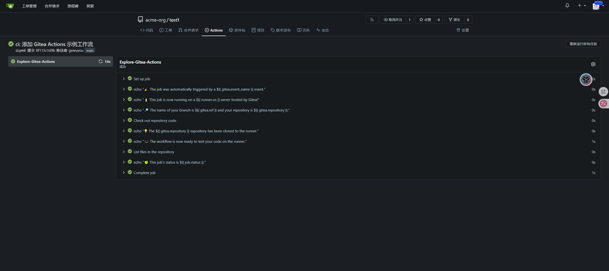

# Gitea安装Runner

> 本节将指导你完成 **安装 Gitea Actions Runner** 的全过程

## 🎯 教程目标

- 本节你将学到：
  - 如何部署 Gitea Actions Runner（基于 Docker Compose）；
  - 如何注册 Runner 到 Gitea；
  - 如何编写 `.gitea/workflows` 工作流文件；
  - 如何触发 CI/CD 流程；
  - 如何理解并部署不同级别的 Runner。

## 📦 步骤说明

### 1. 环境准备

- 已成功安装并运行 Gitea（建议版本 1.21 及以上）；
- Gitea 服务已开启 Actions 支持（默认开启）；
- 已创建一个普通项目用于测试 CI/CD。

### 2. 操作步骤

#### 2.1 使用 Docker Compose 启动 Runner 容器

> 推荐将 Runner 与 Gitea 分开部署，方便维护。

1. 创建一个目录用于保存 Runner 数据，例如：

```bash
mkdir -p ~/docker/gitea/gitea-runners
cd ~/docker/gitea/gitea-runners
```

2. 新建 `docker-compose.yml`：

```yaml
version: "3.8"

services:
  # 这是一个示例runner
  gitea-runner-apple:
    image: gitea/act_runner:latest
    container_name: gitea-runner-apple
    restart: always
    ports:
      - "8088:8088"  # 可选，仅用于缓存服务调试
    volumes:
      - ./act_runner/apple/data:/data
      - ./act_runner/apple/config.yaml:/config.yaml
      - /var/run/docker.sock:/var/run/docker.sock
    environment:
      CONFIG_FILE: /config.yaml
      GITEA_INSTANCE_URL: "http://172.21.235.129:3100/"
      GITEA_RUNNER_REGISTRATION_TOKEN: "s1tGsUUMAWLqZUYFFUg8tpZ6oDmBucjG0nCzYPTX"
      GITEA_RUNNER_NAME: "gitea-runner-apple"
      GITEA_RUNNER_LABELS: "ubuntu-latest:docker://devxci/mbtci-java21-node20,java:docker://devxci/mbtci-java21-node20,node:docker://devxci/mbtci-java21-node20"
      RUNNER_TOOL_CACHE: /data/toolcache
```

3. 在对应目录添加空的配置文件 `config.yaml`

```bash
touch ./act_runner/apple/config.yaml
```

4. 启动 Runner：

```bash
docker compose up -d
```

---

#### 2.2 自动注册 Runner（通过环境变量注册）

上面 Compose 文件中已配置注册所需环境变量，`act_runner` 容器在启动时会自动注册到 Gitea。

如果你需要手动注册，可使用：

```bash
docker run \
    -e GITEA_INSTANCE_URL=<instance_url> \
    -e GITEA_RUNNER_REGISTRATION_TOKEN=<registration_token> \
    -e GITEA_RUNNER_NAME=<runner_name> \
    --name my_runner \
    -d docker.io/gitea/act_runner:latest
```

或者：

```bash
docker run \
    -v $PWD/config.yaml:/config.yaml \
    -v $PWD/data:/data \
    -v /var/run/docker.sock:/var/run/docker.sock \
    -e CONFIG_FILE=/config.yaml \
    -e GITEA_INSTANCE_URL=<instance_url> \
    -e GITEA_RUNNER_REGISTRATION_TOKEN=<registration_token> \
    -e GITEA_RUNNER_NAME=<runner_name> \
    -e GITEA_RUNNER_LABELS=<runner_labels> \
    --name my_runner \
    -d docker.io/gitea/act_runner:latest
```

> 注册成功后，会在 `./apple/config.yaml` 中生成配置信息。(该路径与 Docker Compose 关联)  
> 如果你手动注册，请访问 `$PWD/config.yaml`（当前终端路径）

---

#### 2.2.1 配置 Runner 标签（GITEA_RUNNER_LABELS）

Runner 启动时可通过 `GITEA_RUNNER_LABELS` 环境变量配置多个标签及其对应的运行环境镜像。

##### 🧩 基本格式：

```yaml
GITEA_RUNNER_LABELS: "<标签>:docker://<镜像地址>"
```

##### 🎯 多标签绑定同一镜像：

```yaml
GITEA_RUNNER_LABELS: "ubuntu-latest:docker://devxci/mbtci-java21-node20,java:docker://devxci/mbtci-java21-node20,node:docker://devxci/mbtci-java21-node20"
```

##### 🎯 多标签绑定不同镜像：

```yaml
GITEA_RUNNER_LABELS: "java:docker://devxci/java21-builder,node:docker://devxci/node20-builder,python:docker://devxci/python312-builder"
```

##### ✅ 小贴士

- 标签中不能有空格；
- 标签名称需与 `runs-on` 完全一致；
- 推荐命名规范统一：如 `java`, `node`, `python`。

---

#### 2.3 编写 示例 CI/CD Workflow

创建 `.gitea/workflows/ci.yml`：

```yaml
name: Gitea Actions Demo
run-name: ${{ gitea.actor }} is testing out Gitea Actions 🚀
on: 
  push:
    branches:
      - main
jobs:
  Explore-Gitea-Actions:
    runs-on: ubuntu-latest
    steps:
      - run: echo "🎉 The job was automatically triggered by a ${{ gitea.event_name }} event."
      - run: echo "🐧 This job is now running on a ${{ runner.os }} server hosted by Gitea!"
      - run: echo "🔎 The name of your branch is ${{ gitea.ref }} and your repository is ${{ gitea.repository }}."
      - name: Check out repository code
        uses: actions/checkout@v4
      - run: echo "💡 The ${{ gitea.repository }} repository has been cloned to the runner."
      - run: echo "🖥️ The workflow is now ready to test your code on the runner."
      - name: List files in the repository
        run: |
          ls ${{ gitea.workspace }}
      - run: echo "🍏 This job's status is ${{ job.status }}."
```

推送代码到gitea

最终结果




---

#### 2.4 Runner 分级说明与应用场景

Gitea 支持按以下层级注册 Runner：

| 类型     | 注册位置                   | 适用范围           | 应用场景           |
| -------- | -------------------------- | ------------------ | ------------------ |
| 实例级别 | 管理后台 → Actions Runners | 所有仓库           | 集群共享、全局构建 |
| 组织级别 | 组织设置 → Actions Runners | 当前组织下所有仓库 | 同一组织内共享     |
| 仓库级别 | 项目设置 → Actions Runners | 当前单个仓库       | 项目独立、资源隔离 |

> 其实还有个人级别的runner只有归属于个人下的项目才能使用

##### 示例：同时部署多个 Runner

```yaml
services:
  gitea-runner-global:
    image: gitea/act_runner:latest
    volumes:
      - ./runners/global:/data
      - /var/run/docker.sock:/var/run/docker.sock
    environment:
      GITEA_INSTANCE_URL: "http://172.21.235.129:3100/"
      GITEA_RUNNER_REGISTRATION_TOKEN: "实例级别Token"
      GITEA_RUNNER_NAME: "runner-global"
      GITEA_RUNNER_LABELS: "ubuntu-latest:docker://devxci/mbtci-java21-node20"

  gitea-runner-org:
    image: gitea/act_runner:latest
    volumes:
      - ./runners/org:/data
      - /var/run/docker.sock:/var/run/docker.sock
    environment:
      GITEA_INSTANCE_URL: "http://172.21.235.129:3100/"
      GITEA_RUNNER_REGISTRATION_TOKEN: "组织级别Token"
      GITEA_RUNNER_NAME: "runner-org"
      GITEA_RUNNER_LABELS: "java:docker://devxci/java21-builder"

  gitea-runner-repo:
    image: gitea/act_runner:latest
    volumes:
      - ./runners/repo:/data
      - /var/run/docker.sock:/var/run/docker.sock
    environment:
      GITEA_INSTANCE_URL: "http://172.21.235.129:3100/"
      GITEA_RUNNER_REGISTRATION_TOKEN: "仓库级别Token"
      GITEA_RUNNER_NAME: "runner-repo"
      GITEA_RUNNER_LABELS: "node:docker://devxci/node20-builder"
```

---

### 3. 查看执行状态

1. 打开 Gitea 仓库；
2. 点击顶部导航栏中的 “Actions”；
3. 查看构建任务执行状态与日志。

---

## 🎥 视频地址

[Gitea安装Runner](https://www.bilibili.com/video/BV1GpMbzzEPb/)

---

## ❓ 常见问题

### Q: Gitea 中没有 Actions 入口？

- 确保 Gitea 版本为 1.20+；
- `[actions] ENABLED = true`；
- 启用后台处理队列（默认已启用）；

---

### Q: Runner 启动失败或注册失败？

- 检查配置是否正确；
- 是否创建了空的 `config.yaml` 文件；
- 网络互通是否正常；
- 查看容器日志获取更多信息；

---

### Q: 报错 “open config file /config.yaml: is a directory”？

> 你需要创建一个**空的 config.yaml 文件**，否则 Docker 会把挂载的文件夹当作文件使用，导致错误：

```bash
touch ./act_runner/apple/config.yaml
```

---

### Q: 可以运行多个 Runner 吗？

当然可以，推荐每个项目一个 Runner，也可以按组织或类型划分。

---

> 本节内容遵循 Apache 2.0 协议，欢迎引用与转载，需保留原始署名。
