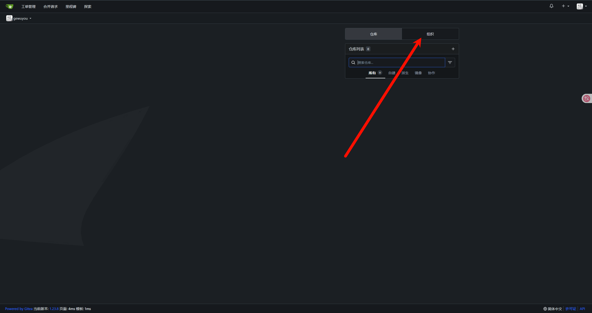
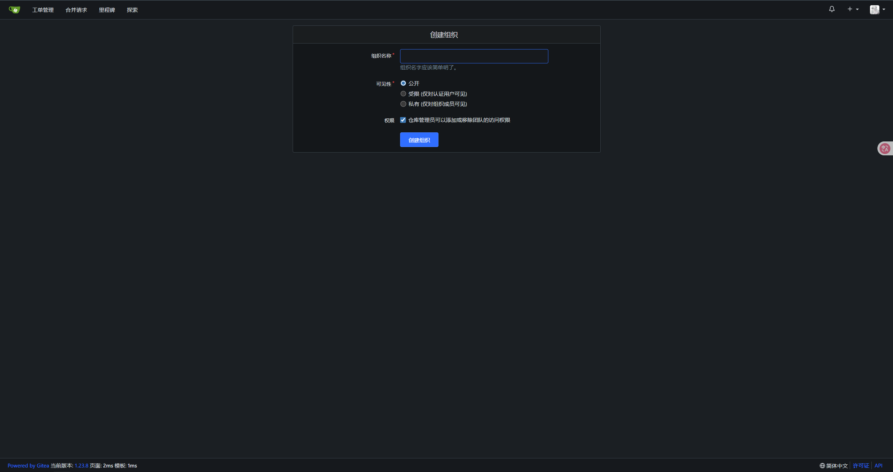
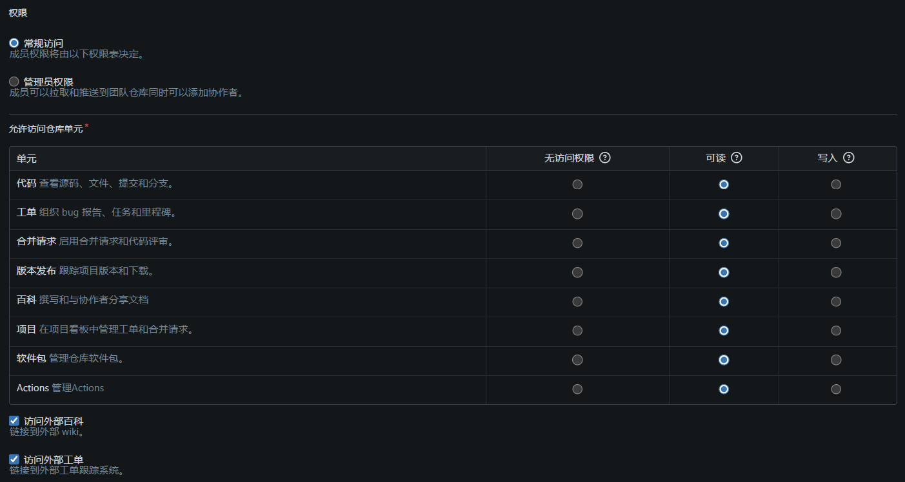

# Gitea组织与团队管理

> 本节将指导你完成 **组织与团队管理** 的相关操作与实战演练，帮助你在 Gitea 中更高效地进行权限划分与协作管理。

## 🎯 教程目标

- 本节你将学到：
  - 如何创建组织；
  - 如何在组织中创建团队；
  - 如何将用户加入团队；
  - 如何为团队分配仓库访问权限；
  - 如何通过团队管理实现权限控制。

## 📦 步骤说明

### 1. 环境准备

- 已成功部署并运行 Gitea；
- 至少拥有一个普通用户和一个管理员用户；

### 2. 操作步骤

#### 2.1 创建组织

1. 登录 Gitea；
2. 点击组织
   - 

3. 点击点击+ → `创建组织`；
   - 
   - 

4. 填写以下信息：
   - 组织名称：例如 `acme-org`
   - 可见性：公开
   - 权限（可选）
   - 
5. 点击 “创建组织”。
   - 

> ✅ 你现在拥有了一个新的组织。

#### 2.2 创建团队

1. 进入组织首页 → 点击 `访问<组织名>` ；
   - 

2. 点击 `新建团队`；
   - 

3. 填写团队信息：
   - 团队名称：如 `dev-team`、`read-team`
   - 仓库权限（用于指定该团队对于组织仓库的访问范围）
     - 
   - 权限（可以根据团队的分工配置不同的操作权限）
     - 
   - 
4. 点击 “创建团队”。

#### 2.3 添加用户至团队

1. 在团队页面，点击`查看`访问团队管理页面；
   - 

2. 点击`添加团队成员`
   - 

3. 输入用户名，选择用户，点击添加。
   - 

> 该用户将拥有对应团队权限，无需直接赋予仓库权限。

#### 2.4 为团队分配组织仓库

1. 若团队创建时未指定仓库：
   - 进入团队详情 → `仓库` → `添加`；
   - 
   - 
2. 勾选要添加的仓库；
4. 点击确认。

#### 2.5 修改或删除团队

- 进入组织 → “团队” → 选择团队；
- 可以：
  - 修改团队名称、描述、权限；
  - 添加/移除成员；
  - 添加/移除仓库；
  - 删除团队（需谨慎操作）。

## 🎥 视频地址

[Gitea组织与团队管理](https://www.bilibili.com/video/BV1i9MBzuENp/)

## ❓ 常见问题

### Q: 用户已加入组织但无法访问仓库？

请检查：
- 用户是否加入了具有对应仓库权限的团队；
- 仓库是否分配给了该团队；
- 团队权限是否为“只读”导致无法推送代码。

### Q: 团队之间权限如何协作？

- 一个用户可以属于多个团队；
- Gitea 会根据“权限并集”授予最终权限；
- 可通过团队分工管理不同模块的仓库访问控制。

### Q: 可以将用户设为组织管理员吗？

Gitea 当前不支持在组织内设定多个“所有者”或“管理员”角色；
组织的创建者默认为唯一拥有完全权限的用户。  
如需授权其他人管理组织，请：
- 创建一个具有“管理”权限的团队；
- 将该用户添加至此团队；
- 通过该团队对仓库和团队进行权限委托管理。

---

> 本节内容遵循 Apache 2.0 协议，欢迎引用与转载，需保留原始署名。
