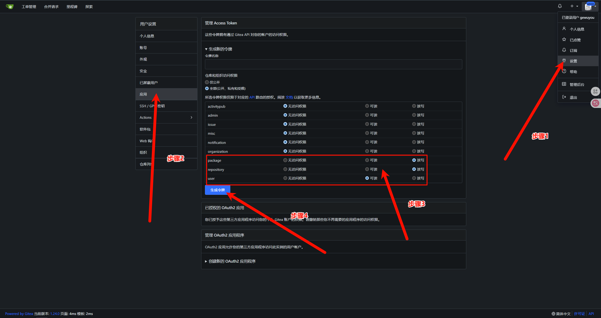

# 📦 使用 Gitea 搭建 Java 私服并发布软件包（支持 Maven 与 Gradle）

> 本节将指导你完成 **将 Java 构建产物通过 Maven 或 Gradle 上传到 Gitea Package Registry** 的全过程，构建一个轻量、私有、可控的 Java 依赖管理仓库。

---

## 🎯 教程目标

- 理解 Gitea Package Registry 支持的 Maven 接口及其通用性；
- 配置 Maven 与 Gradle 构建工具，连接并上传构建产物到 Gitea；
- 能在 Gitea Web 页面查看和管理上传的软件包；
- 为团队构建 Java 依赖私有发布流程打好基础。

---

## 📦 步骤说明

> 教程中的版本是编写教程时使用的版本，无需特别关注

### 1. 环境准备

- Gitea (1.24.0)，已开启 Package Registry（默认开启）
- 创建好的 Gitea 用户及仓库
- 安装 Java (21)、Maven 3.8+、Gradle (8.12.0)（可任选一种构建工具）
- 可构建发布的 Java 项目（含 build.gradle 或 pom.xml）

---

### 2. 创建访问令牌

登录 Gitea 后：

```用户头像 → 设置 → 应用 → 创建访问令牌```



- 勾选权限：
  
  ```text
  write:package
  write:repository
  read:user
  ```
  
- 复制保存 access_token（后续作为密码使用）

---

### 3. 配置构建工具上传信息

以下分别为 **Maven** 和 **Gradle** 的配置方式：

---

#### ✅ Maven 配置

**修改项目 `pom.xml`：**

```xml
<repositories>
  <repository>
    <id>gitea</id>
    <url>https://{gitea_url}/api/packages/{owner}/maven</url>
  </repository>
</repositories>
<distributionManagement>
  <repository>
    <id>gitea</id>
    <url>https://{gitea_url}/api/packages/{owner}/maven</url>
  </repository>
  <snapshotRepository>
    <id>gitea</id>
    <url>https://{gitea_url}/api/packages/{owner}/maven</url>
  </snapshotRepository>
</distributionManagement>
```

**配置 `~/.m2/settings.xml`：**

```xml
<settings>
  <servers>
    <server>
      <id>gitea</id>
      <configuration>
        <httpHeaders>
          <property>
            <name>Authorization</name>
            <value>token {access_token}</value>
          </property>
        </httpHeaders>
      </configuration>
    </server>
  </servers>
</settings>
```

> 💡 注意 `<id>` 名称必须与 `pom.xml` 中一致。

---

#### ✅ Gradle 配置

**在项目的 `build.gradle.kts` 中添加：**

```kotlin
publishing {
    publications {
        create<MavenPublication>("mavenJava") {
            groupId = 'com.example'
            artifactId = 'my-lib'
            version = '1.1.4'
            from(components["java"])
        }
    }
    repositories {
        maven {
            //注意如果没有https使用的是http，请开启此项
            //isAllowInsecureProtocol = true
            name = "gitea"
            url = uri("https://{gitea_url}/api/packages/{owner}/maven")
            credentials(HttpHeaderCredentials::class.java) {
                        name = "Authorization"
                        value = "token {access_token}"
                    }
                    authentication {
                        create("header", HttpHeaderAuthentication::class.java)
                    }
        }
    }
}
```

| 参数           | 描述                                                         |
| -------------- | ------------------------------------------------------------ |
| `access_token` | 您的[个人访问令牌](https://docs.gitea.com/zh-cn/development/api-usage#通过-api-认证) |
| `owner`        | 软件包的所有者                                               |
| `gitea_url`    | 您的gitea访问路径                                            |


**启用插件（如未启用）：**

```groovy
apply plugin: 'maven-publish'
```

> 💡 可以将`GITEA_TOKEN` 抽取为环境变量提高安全性。

---

### 4. 上传软件包

使用对应命令将构建产物上传到 Gitea：

- **Maven 上传：**

```sh
mvn clean deploy
或者
mvn deploy
```

- **Gradle 上传：**

```sh
./gradlew publishAllPublicationsToGiteaRepository
```

---

### 5. 在 Gitea 界面查看包信息

进入 Gitea → 目标仓库 → **Packages** 标签页  
你将看到上传的包，包含：

- `groupId`、`artifactId`
- 版本号
- 上传用户
- 下载链接

### 6. 安装软件包

✅ Maven 项目

在您项目的 `pom.xml` 文件中设置此注册中心：

```xml
<repositories>
	<repository>
		<id>gitea</id>
<url>http://{gitea_url}/api/packages/{owner}/maven</url>
	</repository>
</repositories>

<distributionManagement>
	<repository>
		<id>gitea</id>
		<url>http://{gitea_url}/api/packages/{owner}/maven</url>
	</repository>

	<snapshotRepository>
		<id>gitea</id>
		<url>http://{gitea_url}/api/packages/{owner}/maven</url>
	</snapshotRepository>
</distributionManagement>
```
要从软件包注册表中安装 Maven 软件包，请在项目的 `pom.xml` 文件中添加新的依赖项

> 请自行替换groupId artifactId version

```xml
<dependency>
  <groupId>com.test.package</groupId>
  <artifactId>test_project</artifactId>
  <version>1.0.0</version>
</dependency>
```

✅ Gradle 项目

在您项目的 `build.gradle.kts` 文件中设置此注册中心：

```kotlin
repositories {
	    maven{
        url = uri("http://{gitea_url}/api/packages/{owner}/maven")
       // 请注意，如果你的是http请开启此项
       // isAllowInsecureProtocol = true
    }
}
```

通过这个导入

```kotlin
implementation ("com.test.package:test_project:1.0.0")
```

---

## 🎥 视频地址

[使用 Gitea 搭建 Java 私服并发布软件包](https://www.bilibili.com/video/BV1nSNYzdEqc/)

---

## ❓ 常见问题

1. **Q: 是否支持快照版本（Snapshot）？**  
   A: 截止 Gitea 1.21，仅支持 Release 包，不支持 Maven snapshot。

2. **Q: 如何删除上传的包？**  
   A: 进入 Gitea → 仓库 → Packages → 选择包版本 → 点击删除。

3. **Q: 上传提示权限不足？**  
   A: 检查 token 是否具有 `write:packages` 权限，或仓库权限不足。

4. **Q: 是否可以匿名下载？**  
   A: 下载权限遵循仓库权限控制，私有仓库需要登录或 token。

---

## 📝 许可证

> 本节内容遵循 **Apache License 2.0** 协议，欢迎引用与转载，需保留原始署名。
